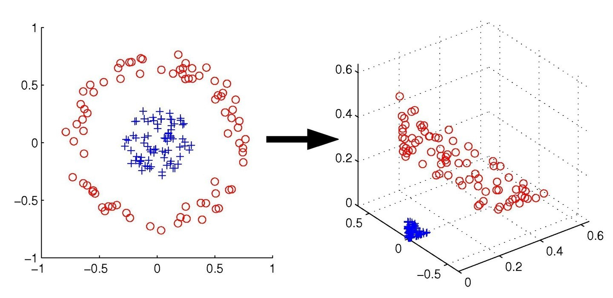
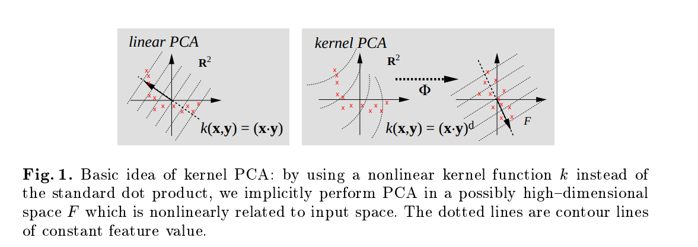

The kernel method is one very popular approaches for learning from various input data including structured input, structured output or other tabular format.
The concept of kernel machines is build on the top of a special type of functions, referred to as **kernel functions**.
They provide implicit nonlinear transformation of the data into higher-dimensional (potentially infinite dimensional) without having an explicit form for the mapping function.
Instead, this transformation is implicitly computed using a kernel function.

This concept is illustrated on the following figure:

The data on the left part of the image is not linearly separable in the original space. However, once we apply a kernel function, we add a third dimension that allows to
separate the data linearly in the higher-dimensional space. More specifically, the applied transformation of the dimensions are: $(x_1, x_2)$ on the left are transformed via the function $\phi(x) -> (x_1^2, x_2^2, \sqrt 2 x_1x_2)$.

Check this [video](https://www.youtube.com/watch?v=3liCbRZPrZA) as well.

### Kernel functions

Kernel functions have two arguments as input ($\phi: R^d->F$ such that $K(x, x^1)= <\phi(x), \phi(x^1)>$). The output value correspond with the dot product of the nonlinear mappings applied to the both of the input arguments separately. This powerful representation allows to rewrite majority of the linear methods with respect to the dot product of its inputs. Then the kernel methods just bolis down to replacing the dot product with an appropriate kernel function of the inputs. The utilization of a kernel function instead of the dot product is referred to as the "kernel trick" (the dot product is just a special type of so called linear kernel).

Not any function is a kernel function. For a function to be a kernel function it must satisfy two conditions:

* 1) it is **semi-positive definite** and

* 2) **symmetric**.

These conditions are also know as **Mercer conditions**. The kernels have further interesting properties: e.g sum of two kernels is a kernel function, polynomial of kernel functions is a kernel function, product of a positive constant and a kernel is a kernel, product of two kernels is a kernel etc. Following Mercer conditions, all these properties are easy to prove.

The advantages of kernels is that they have nice theoretical properties. The mapping applied to the high dimensional space makes the use of the **"bless of dimensionality"**, where, because of the sparsity of the points, application of standard linear methods can lead to very good results. The kernel can be seen as similarity between the data points or even as a structure that can embed some prior knowledge for the given problem. This is especially powerful since allow us to generalize the applications of the kernel methods to data with structure of both the input and output. Also the kernels can be seen as regularization operators with regularization properties that can be expressed in Fourier space. With sufficient regularization kernel methods often outperform its counter part. Finally, kernels allow us to work in high dimensional space with interesting features for themselves. A great resource for learning with Kernel is the book on [Kernels by Bernhard Schölkopf and Alex Smola](http://agbs.kyb.tuebingen.mpg.de/lwk/).

### The representer theorem (RKHS - Reproducing Kernel Hilber Space)

The **representater theorem** provides a theoretical proof of the equality on the kernel function as dot-product of the mappings of the inputs.

It there is a mercer kernel K on $R^d$, than there exist a Hilbert space F (a vector space where norm and dot product are defined) and a continuous map: $\phi: R^d->F$ such that $K(x, x^1)= <\phi(x), \phi(x^1)>$ for all $x, x^1 \in R^d$.

Some examples of kernel functions are:

* polynomial $k(x,y)=(xy+c)^d$

* RBF $k(x,y)=exp(-\frac{\|\|x-y\|\|^2}{2\sigma^2})$

* inverse multiquadratic $k(x,y)=\frac{1}{\sqrt(\|\|x-y\|\|^2+c^2)}$

Many more examples of kernels can be found [here](http://crsouza.com/2010/03/17/kernel-functions-for-machine-learning-applications/).

Gaussian kernel corresponds to the general smoothness assumption.

In the following we are going to discuss several kernel methods:

* 1) Kernel SVM for classification

* 2) Learning algorithms for Kernel SVM, Platt's SMO (Sequential Maximization Optimization)

* 3) Support vector data description (SVDD)

* 4) Kernel Density Estimation for anomaly detection

* 5) One-class SVM for anomaly detection

* 6) Kernel PCA for dimensionality reduction

* 7) Kernel Ridge regression

* 8) Kernel methods for structured inputs

* 9) Kernel methods for structured outputs

### Example of kernelazing linear regression

To rewrite a linear method as a kernel we start with $y=w^Tx$. The optimal values for the parameters of the methods must lie within the span of the data. Using this we can rewrite $w=x \alpha$. Then $y=\alpha^Tx^Tx$. This means that we can rewrite the linear method as a dot-product of the input variables and can apply a kernel function. According to it $y=\alpha^TK(x,x)=\alpha \phi^T(x)\phi(x)=\sum_i^N\alpha \phi^T(x_i)\phi(x)$, where $K(x,x)$ is a kernel function. Usually during the training phase we need to calculate the parameters $\alpha$. During the test phase we are caluclating the predictitions using the kernel between the training points and test points as well as the multiply by the coefficients $\alpha$ calculated during the learning phase.

### Support Vector Machines (SVMs)
Before describing the transformation of Support Vector Machines in kernel form, we derive their linear formulation. Afterwards we give their kernel verison.

Support Vector Machines are popular method in supervised machine learning. Compared to the perceptron method they differ in a way that instead of finding the first linear boundary of arbitrary "quality", SVMs find the optimal one. The optimal linear boundary is defined as a hyper-plane that is simultaneously at the equal distance to the points in both of the classes. With other words it has the largest **margin**. The **margin** represents the maximal distance between the hyperplane and the points from both of the classes. The basic idea is to have this margin to be as maximal as possible.

We first explain the so called "hard SVM" problem. We assume that the classes are linearly separable. We assume that the class can be $\{-1, 1\}$, where -1 denots the "negative", while the 1 denotes the "positive" part of the hyperplane assigned to each of the classes. The distance of a point $i$ to the hyperplane is given with the simple $\beta^Tx_i + \beta_0$ equation. Assuming that the smallest distance is $c$, it further can be normalized.

\begin{equation}
d_i = \frac{y_i(\beta^Tx_i + \beta_0)}{||\beta||} \geq c \frac{1}{c}
\end{equation}

We divide with c, in that way we are making the smallest possible distance in the space to be 1.

\begin{equation}
d_i = \frac{y_i(\beta^Tx_i + \beta_0)}{||\beta||c} \geq 1
\end{equation}

The goal is to maximize the margin for all the points:
\begin{equation}
\max_{\beta} d_i <=> \max_{\beta} \frac{y_i(\beta^Tx_i + \beta_0)}{||\beta||^*}
\end{equation}

The later is ill defined problem. We introduce a corresponding constraint to make it well defined and rewrite the optimization function.

\begin{equation}
\max_{\beta} d_i <=> \min_{\beta} \frac{1}{2}\beta^T\beta
\end{equation}
\begin{equation}
y_i(\beta^Tx_i + \beta_0) \geq 1
\end{equation}
for all the points $1 \dots n$.

To solve this optimization problem we apply the Lagrangian method. We first write the Lagrangian dual form with respect to the dual variables $\alpha \geq 0$.

\begin{equation}
\max_{\beta} d_i <=> \min_{\beta} \frac{1}{2}\beta^T\beta => \max_{\alpha} 1/2\beta^T\beta - \sum_i^N\alpha_i[y_i(\beta^Tx_i + \beta_0) - 1]
\end{equation}

We calculate now the partial derivatives of the Lagrangian with respect to the parameters $\beta$, $\beta_0$ and $\alpha$.

\begin{equation}
\frac{\delta L}{\delta \beta} = \beta - \sum_i \alpha_iy_ix_i = 0 => \beta = \sum_i \alpha_iy_ix_i
\end{equation}

\begin{equation}
\frac{\delta L}{\delta \beta_o} = \sum_i \alpha_iy_i = 0
\end{equation}

We can now rewrite the cost function in terms only on the parameters $\alpha$.
\begin{equation}
\max_{\beta} d_i <=> \min_{\beta} \frac{1}{2}\beta^T\beta => \max_{\alpha} 1/2\beta^T\beta - \sum_i^N\alpha_i[y_i(\beta^Tx_i + \beta_0) - 1] = \frac{1}{2} \sum_i\sum_j \alpha_i\alpha_jy_iy_jx_i^Tx_j -  \sum_i\sum_j \alpha_i\alpha_jy_iy_jx_i^Tx_j -  \sum_i\alpha_iy_i\beta_0 + \sum_i \alpha_i = -\frac{1}{2} \sum_i\sum_j \alpha_i\alpha_jy_iy_jx_i^Tx_j + \sum_i \alpha_i
\end{equation}
s.t:
\begin{equation}
\alpha_i \geq 0
\end{equation}

\begin{equation}
\sum_i \alpha_iy_i= 0
\end{equation}
This is a quadratic loss function with linear constraints. As such it can be solved by any solver of quadratic programming problems.

Further, we need to check if the KKT (Kaurn-Kuhn-Tucker) conditions hold.

1) The derivative of the Lagrangian in the characteristic point is 0;

2) The primal conditions are met

3) The dual conditions are met

4) Complementary slackness; The product of the dual variable and primal constraint should be equal to 0;
\begin{equation}
\alpha_i y_i(\beta^Tx_i + \beta_o)=0
\end{equation}

For the 4) point to be true, there are two cases, either $\alpha_i = 0$. This means that $y_i(\beta^Tx_i + \beta_o) \geq 0$. So for the points that do not lie on the marginal lines the coefficient $\alpha_i$ are zero.
The second case involves that $y_i(\beta^Tx_i + \beta_o)=0$, which means that the point lie on the margin. In that case $\alpha_i$ > 0. This points are called support vectors. For SVM, those are inedeed the most important points that make the distiction between the different classes. One can see that in that regard SVM is a vert efficient algorithm since it requires just the support vectors to be stored in the memory, as well the corresponding coefficients (if primal formulation of the problem is considered). There are various algortihms that are implementing the SVM paradigm for classification, e.g. John's Platt SMO (sequential maximization optimization). We will discuss them later when putting the SVM in the context of kernels.

In the following we will explain the **soft margin** case for support vector machines that extends the hard margin case allowing for modeling of cases where there is no linear separability between the classes via the introduction of a novel slack variable that amounts for the allowed violotation (overshoot) over the margins.

### Kernel SVM for classification
Following the discussion for kernels taking into consideration the form of SVM as a dot product of the inputs, it is very easy to apply the kernel trick and rewrite the method in a kernelized form.
\begin{equation}
\max_{\alpha} -\frac{1}{2} \sum_i\sum_j \\ \alpha_i\alpha_jy_iy_j\phi(x_i)^T\phi(x_j) + \sum_i \alpha_i = \\ -\frac{1}{2} \sum_i\sum_j \alpha_i\alpha_jy_iy_jK(x_i, x_j) + \sum_i \alpha_i
\end{equation}
s.t:
\begin{equation}
\alpha_i \geq 0
\end{equation}

### Algorithms for efficient solving the SVM problem

#### Sequential Minimal Optimization

There are various approaches to solve the SVM problem. One of the most frequently used is the **SMO** by Platt [Sequential Minimal Optimization](https://www.microsoft.com/en-us/research/wp-content/uploads/2016/02/tr-98-14.pdf). It basically, selects 2 points from the dataset and rewrites the optimization function with respect to them. This allows to have closed form solution for the parameters for the pair of points. Also, specific set of constraints needs to be satisfied. Via several iterations, one can obtain the optimal solution for the coefficients, one pair of them at the same time. There are various heuristics how to choose the pair of points.

#### Solving via gradient descent

If one is utilizing the primal formulation of the problem, it can solve it via using stochastic gradient descent. To solve this, we define the regularized SVM cost function utilizing the **hinge loss**. The **hinge loss** suggest for a value x assigns the $h(x)=max(0, X)$ for the loss.

Formally, the optimization problem can be rewritten as:

\begin{equation}
\min_{w \in R^d} \frac{1}{2}w^Tw + C \sum_{i=1}^N\epsilon_i
\end{equation}
s.t
\begin{equation}
y_i(w^Tx_i+b) - 1 + \epsilon_i \geq 0
\end{equation}
goes into

\begin{equation}
\min_{w \in R^d} \frac{\lambda}{2}w^Tw + \frac{1}{n} \sum_{i=1}^N h(1-y_i(w^Tx_i + b))
\end{equation}
where the latter term corresponds to the amount of violation of the margin constrained.
For the gradient update we have:
\begin{equation}
\nabla_w = \lambda w - \frac{1}{n}\sum_{i=1}^N y_i x_i I(y_i(w^Tx_i+b)\leq 1)
\end{equation}
The negative part of the expression for the gradient can be seen as expectation over uniform distribution. That is why it is easy to obtain a fast solution for this problem. Unfortunately it does not generalize for the kernel formulation of the problem since one cannot rewrite it in form of dot product.

## Kernel-based feature representation
Feature representation is one of the key task in machine learning. Finding the most suitable representation can improve the generalization, improve the results, better visualization, reducing the time and space complexity etc.
Kernel-based approaches are a popular way how to provide an efficient feature representation. In the following we present one common approach.

### Kernel PCA

[Kernel PCA](https://people.eecs.berkeley.edu/~wainwrig/stat241b/scholkopf_kernel.pdf) is a method for dimenisionality reduction. It addresses the limitation of the linear PCA method. PCA assumes that the data exist on a linear manifold (or a subset of the manifold). To do this it uses the "kernel trick", as described above.
The kernel function is given with:

\begin{equation}
K(X, X) = \phi{(X)}^T \phi{(X)}
\end{equation}

As discsussed, the main benefit with using kernels is that we are not required to know the exact form of $\phi{(X)}$. (in the most general case can be a mapping to an infinite dimensional space (e.g Gaussian kernel). This implies that there does not exist any inverse mapping (or reverse image)). The kernel can be seen as similarity between two functions of the input in arbitrary dimensional space. In such (usually high dimensional) space the "curse of dimensionality" becomes "bless of dimensionality" since the points are easily separable (e.g a linear classifier can be very effective since almost everything is linear there).

To derive the Kernel PCA method we can refer to the Dual PCA and whenever we have X we will replace it with $\phi{(X)}$.

##### Dual PCA

If one is familiar with kernels, it can imminently recognize that $X^{T}X$ is a linear kernel calculated on data $X$. This allows us to define a whole family of approaches that are closely related with PCA or are its generalization e.g dual, kernel and supervised PCA. Dual PCA is beneficial in the case where $d>n$. Then we perform singular value decomposition on smaller matrix. Utilizing the fact that it is cheaper to calculate the eigenvectors of $X^{T}X$ in the described step, we can rewrite the PCA algorithm such that we replace $U$ with expression that depends on $X$, $\lambda$ and $V$.

\begin{equation}
X = U \lambda V^{T} /V
\end{equation}
\begin{equation}
XV = U \lambda /\lambda^{-1}
\end{equation}
\begin{equation}
XV\lambda^{-1} = U
\end{equation}

To project data in p-dimensional space (we assume that we are working with the truncated matrices):
\begin{equation}
U^{T}/ X = U \lambda V^{T}
\end{equation}
\begin{equation}
Y = U^{T}X = \lambda V^{T}
\end{equation}

To reconstruct training data:
\begin{equation}
X = UY
\end{equation}

replacing the above equations:
\begin{equation}
X_{rec} = XV \lambda^{-1}\lambda V^{T} = XVV^{T}
\end{equation}

for one point $x$ out of sample projection:
\begin{equation}
y = U^{T}X = \lambda^{-1}V^{T}X^{T}x_{new}
\end{equation}

for one point $x$ out of sample reconstruction:
\begin{equation}
x_{rec} = UY = XV\lambda^{-1}\lambda^{-1}V^{T}X^{T}x_{new}
\end{equation}
note $\lambda$ is a matrix of eigenvalues of the sample covariance matrix. As such it is a diagonal matrix (real-valued) that has an inverse.

Substituting for $\phi(x)$ we obtain Kernel PCA:

\begin{equation}
\phi{(X)} = U \lambda V^{T} /V
\end{equation}
\begin{equation}
\phi{(X)}V = U \lambda /\lambda^{-1}
\end{equation}
\begin{equation}
\phi{(X)}V\lambda^{-1} = U
\end{equation}

Recalling that in most general form we do not know what is the mapping $\phi{(X)}$, it is pretty obvious that not all steps from the Dual/Kernel PCA are possible. We can project a new point to the $p-$dimensional space and can provide out of sample reconstruction. However, we cannot project back any training point back to the original space, nor can reconstruct out of sample point back. They explicitly involve the mapping $\phi{(X)}$ not their dot-product. Again as in the case of Dual PCA, we need to calculate the right eigenvectors and the eigenvalues of the kernel matrix. Additional catch one should take in care is that it needs to centralize the kernel data in the kernel space (an operation that boils down to summation and subtraction of kernels). The summation of two kernels is again a kernel function.

## Kernel-based anomaly detection techniques
[Anomaly detection](https://arxiv.org/abs/2009.11732) is important practical task in machine learning. It is concerned with identifying samples that deviates considerably from some concept of normality. It is closely related to novelty and outlier detection (albeit the same task). Novelty is an instance from some new region or mode of an evolving non-stationary distribution. Outlier is being a rare or low probability instance from the normal class. Anomaly is characterized as being an instance from a distinct distribution then the normal class.

Due to the increased representational power of the normality class, kernels are popular approach for anomaly detection. In the following, we present several approaches for AD based on kernels.
The SVM based approaches work in a way trying to learn a decision boundary that corresponds to a desired density level set of the normal data distribution. As such they are discriminative approach for anomaly detection.

### Kernel PCA for anomaly detection
Uncentered PCA projection in feature space can be written as:
\begin{equation}
\phi(x)=\sum_{i=1}^hu_iu_i^T\phi(x) + \sum_{i=h}^du_iu_i^T\phi(x)
\end{equation}
then the reconstruction error is given as: $o(x)=||\sum_{i=h}^du_iu_i^T\phi(x)||^2$.
For high dimensions, we can only compute empirical principal components. An interpolated projection on the i-th empirical principal component is given by:
\begin{equation}
proj_i(x)=k(x,X)U_{:,i}\lambda_i^{-0.5}
\end{equation}
then $o(x)=||\sum_{i=h}^du_i^Tproj(x)^2$.

### Support vector data description (SVDD method) for anomaly detection
SVDD is another method that is based on the SVM paradigm and it is used for anomaly detection (unsupervised). It assumes that the data lie within a sphere with radius **R** and centre **c**. The points inside the sphere are considered as inliers (normal) while the points outside of the sphere are considered as outliers. We can defined constrained quadratic programming problem to perform this optimization.

\begin{equation}
\min_{R,c,\epsilon} R^2 - \frac{1}{N\eta}\sum_{i=1}^N\epsilon_i
\end{equation}
s.t
\begin{equation}
||\phi(x_i)-c||^2 \leq R^2 + \epsilon
\end{equation}
and $\epsilon \geq 0$ and $\eta$ is an upper bound on the fraction of outliers, and a lower bound
on the fraction of support vectors. Furthermore, we can write the dual optimization problem from here as:

\begin{equation}
\max_{\alpha} \sum_{i=1}^N\alpha_iK(x_i, x_i) - \sum_{i=1}^N\sum_{j=1}^N\alpha_i\alpha_jk(x_i,x_j)
\end{equation}
s.t
\begin{equation}
\sum_{i=1}^N\alpha_i = 1
\end{equation}
for all points i, $0\leq\alpha\leq\frac{1}{N\eta}$.

To make a decision if a point is anomaly or not one simply calculate the following expression:
$||\phi(x)-c||^2\geq R^2$. This can be translated into a dual formulation such that it does not require for the explicit presence of the mapping.
\begin{equation}
K(x,x) - \sum_{i=1}^N\alpha_iK(x_i, x_i) + \sum_{i=1}^N\sum_{j=1}^N\alpha_i\alpha_jk(x_i,x_j) \geq R^2
\end{equation}

### One-class SVM
The model in OCSVM is a separating hyperplane from the origin. The points beyond the hyperplane are
considered to be inliers as opposed the points closer to the origin considered to be outliers. Such problem is defined as a maximum separating hyperplane and can be optimizied via quadratic programming.
The primal problem is given as:

\begin{equation}
\min_{w,\rho,\epsilon} \frac{1}{2}||w||^2 - \rho + \frac{1}{N\eta}\sum_{i=1}^N\epsilon_i
\end{equation}
s.t
\begin{equation}
<\phi(x_i),w> \geq \rho - \epsilon_i
\end{equation}
for all points $i$ in the training set.

The dual is given as:
\begin{equation}
\max_{\alpha} - \frac{1}{2}\sum_{i=1}^N\sum_{j=1}^N\alpha_i\alpha_jk(x_i,x_j)
\end{equation}
s.t
\begin{equation}
\sum_{i=1}^N\alpha_i = 1
\end{equation}
for all i, $0\leq\alpha\leq\frac{1}{N\eta}$.
The diffeirence between OCSVM and SVDD is that the former is fitting a hyperplane, while the later a hypersphere. The inliers in the former are points beyound the hypersphere, further from origin, while in the later the points closer to the centar of the sphere are inliers.

## Kernel-based methods for regression

## Kernel-based for structured input and output prediction
