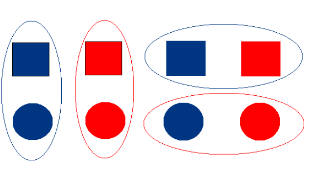
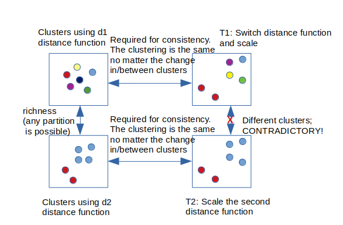
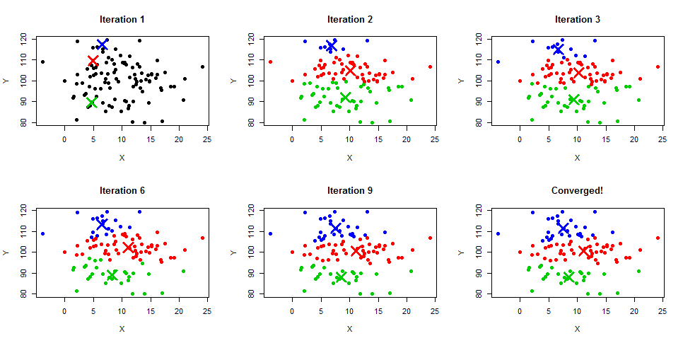
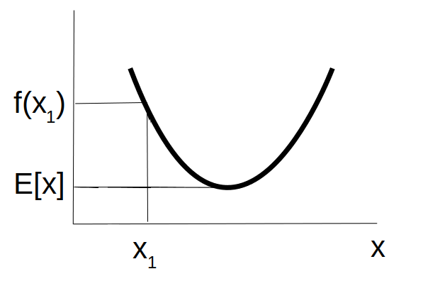
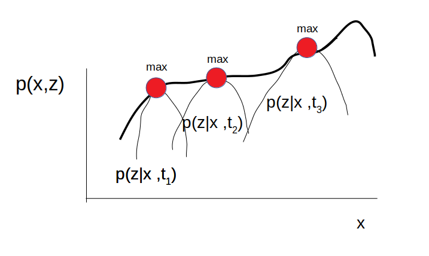

Clustering
==========

Clustering is a task from the unsupervised learning paradigm in machine
learning. The goal of clustering is to find groups of samples sharing
similar characteristics. The properties of the groups are such that the
samples within the groups are similar to each other, while the
samples between the groups are different. One main challenge in
clustering is defining “what does it mean for samples to be similar?”.
As a topic arises from the need to categorize the similarity between a
set of heterogeneous objects (based on some notion of similarity).

In essence, clustering is an ill-defined problem. When given data
without labels the notion of similarity is vague. Let’s think of the
following example: let’s assume we have a dataset with four samples. The
examples have two features: shape and colour; 1) red square 2) red
circle 3) blue square 4) blue circle. If we want to find two natural
groups in the data, it is not clear what they are (if we do not have a
clear goal of if we want to separate the red from the blue or squares
from the circles). The two groups can be either group 1 (samples 1
and 4;  group 2 (samples 2 and 3) or the two groups can be composed of
group 1 (samples 1 and 2) and group 2 (samples 3 and 4). Thus
clustering is an ill-defined problem.

------------------------------------------------------------------------

More formally, we can define clustering as follows. A clustering
function is any function $f$ that takes a set $S$ of $n$ samples with
pairwise distances between them and returns a partition of $S$. There is
no constraint on the samples constructing the set $S$. The only
information we have available for the samples are the pairwise distances
between them.

Clustering is an interesting topic of research as well as
application. An interesting work on clustering is the axiomatic framework introduced by Kleinberg [Kleinberg
2002](http://alexhwilliams.info/itsneuronalblog/papers/clustering/Kleinberg_2002.pdf).
In this work, Kleinberg makes a set of intuitive assumptions about the
properties a cluster group should satisfy with respect to the other groups
and the group itself. On top of them, a theorem and
proof are introduced claiming that all the properties cannot be satisfied at the same time.
As such Kleinberg provides a theoretical frame for the difficulty of the problem.

Basic axioms about the groups (Kleinberg 2002) should satisfy are:

1.  **scale-invariance;** The results from the clustering should not
    change when the data change their scale.

2.  **consistency:** If we change the distances (shrinking and
    stretching) between the given samples, such that we increase the
    between cluster distance or decrease the within-cluster distance,
    the results of the clustering should not change;

3.  **rich:** Given is a set of data points for which we do not know anything about their distance.
An ideal clustering function would be flexible enough to produce all possible partition/clusterings of this set.
It means that all partitions of the set $S$ are achievable.

However, one can prove that none of the three properties can hold simultaneously (but there are many cases where 2 out of 3 holds).
For more details, refer to the paper.

A simple visual illustration for the contradictory obtained is depicted in
the following image. Let’s assume that all the three axioms hold.
Due to the richness axiom there exist two distance measure $d_1$ and
$d_2$ that can realize any possible partition on $S$ (top and bottom
left). We can define a third distance measure $d_3$ that scales $d_2$ so
that the minimum distance between points in $d_3$ space is larger than
the maximum distance in $d_1$ space. It is a clear contradiction. The
clustering should remain unchanged after the T1 and T2 transformation.

------------------------------------------------------------------------

Practical considerations when applying clustering
======================

When applying some of the common approaches for clustering, several
usual questions need to be considered:

1.  The number of clusters; It is not clear what is the exact number of clusters existing in a dataset. There are heuristics like the
    **“elbow-method”** that can be used to find this number. However,
    these methods should be taken with caution (due to the ill-definition of the clustering problem). Some methods do not require the number of clusters predefined.

2.  Having a good **similarity measure**; It is not clear what does a
    similar and different object look alike. Before applying clustering to a given set of samples, one should carefully examine the data and define the similarity appropriately.

3.  It is difficult to determine which samples are **outliers** and
    clusters for themselves, especially in high dimensional space. In
    high dimensional space, the data samples are usually far apart
    between one another and it can be hard to distinguish between group
    of samples.

4.  It is difficult to differentiate among overlapping clusters;

A common strategy when solving a clustering problem is to apply several
clustering methods in an ensemble like clustering or sometimes referred
to as **collaborative clustering**. In such a way one may end up in a
set of clusters with higher confidence that indeed represent some
phenomena in the data. The number of clustering methods is quite
large. Generally, the approaches are grouped according to the underlying
paradigm they adopt. Most frequently they are separated into:
agglomerative, spectral, information-theoretic, centroid-based, methods
from combinatorial optimization and probabilistic generative models.

In this post we will consider:

1.  **K means/k medians**; is a goto method for clustering;

2.  **Hierarchical clustering** (**Agglomerative clustering** with
    different linkages (distances between a set of samples) ward, single,
    complete etc. or **Divisive clustering** e.g tree-like methods such
    as Predictive Clustering Trees);

3.  **Spectral clustering**; Based on graph theory.

4.  **Gaussian Mixture models** (and other Bayesian techniques); This method allows for the term **soft clustering** assigning a point to multiple clusters with a specific confidence.
Having aforementioned uncertainty can be very neat in some cases.

Additionally in this post, we are going to introduce:

1.  **Jensen inequality**

2.  **Expectation maximization principle**

3.  **Coordinate descent**

4.  **Soft clustering**

5.  **Consensus clustering**

6.  **Ensemble of clusters**

7.  **Linkage**

8.  **Biclustering**

9.  **Density estimation**

10. **Graph, (edges, nodes, Laplacian, adjacency, spectral gap, Fiedler
    value, graph cut, ratio cut)**

Methods for clustering
======================

In the following we present several methods for clustering.

K means/median algorithms
-------------------------

K means is conceptually one of the simplest methods for clustering
[MacQueen](https://projecteuclid.org/euclid.bsmsp/1200512992).

It starts with assumtpion of knowing the number of clusters. Then it
picks some random points from the data; refered to as centroids (using
various algorithms such as Loyd’s, or kmeans++). In a second step it
calculates the distances to all the other points to each of the
clusters. Each point is assigned to the cluster that has the smallest
distance to it. This new reorganization of the clusters form the first
iteration. Then it recalculates the centroids as mean (in case of k
means or median i case of k median). The same procedure is repeated
until some specific convergence criterion is not reached. Commonly used
stopping criteria is the smallest improvement of the sum of squared
euclidean distances (refered to as inertia) of all points to their
nearest cluster is smaller then some predefined threshold. Note, replace
mean with median and you have k-median clustering.

Algorithmically, this can be written as:

**Algorithm**

**Input:** k number of clusters; $X \in R^{nxd}$; convergence criteria
(e.g no change in cummulative cost function J greater then
$\epsilon -> 0$

**Output:** k partitions of total of n points, where each point in $X$
is part of one and only one $S_k$

1.  Intiilze the centorids

2.  while convergence

    2.1. assing points to centroid $i$, such that point $x_i$ is
    assigned to cluster $c_k$ such that $argmin_k (c -  x_i)^2$

    2.2. recalucate the centorids as
    $c_k=\frac{1}{n_k}\sum_{i \in k}x_i$

Step by step visualization of the method can be seen on the following
image. The image is taken from the following
[link](http://www.learnbymarketing.com/methods/k-means-clustering/).

There are various measures to measure convergence. The optimization
function can be written as
$(J(c, \mu)=\sum_{i=1}^m||x^i-\mu_{c(i)})||^2)$. Having the following
cost function **kmeans** can be defined as **coordiante descent** on the
cost function **J**. **Coordinate descent** is an optimization algorithm
that successively minimizes along coordinate directions to find the
minimum of a function. At each iteration, the algorithm determines a
coordinate or coordinate block via a coordinate selection rule, then
exactly or inexactly minimizes over the corresponding coordinate
hyperplane while fixing all other coordinates or coordinate blocks
[Wiki](https://en.wikipedia.org/wiki/Coordinate_descent). To some extend
one can consider **kmeans** as example of the **Expectation
Maximization** principle discussed later in this post. The intuition
behind the EM similarity comes from the fact that during EM, during the
E step the expectation is calculated (corresponding to the calculation
of the mean) while during the M step the expectation is maximized
(corresponding to the assigmnet of each point to the corresponding
cluster).

### Biclustering

Clustering of tabular data by rows and columns at the same time is
called **biclustering**. One frequent usage is in gene expression among
various samples.

Spectral clustering
-------------------

Spectral clustering is a clustering approach used to produce groups of
data given a set of $n$ unlabelled observations on which we can define
some similairty measure. As a method it draws close connections to graph
theory.

**Graph** is a mathematical abstraction that is useful for modeling
various set of problems. Formaly, it is composed of two sets of objects.
The first set is a set of **verticies**, while the second is refered to
as set of **edges**. The edges are connecting two verticies in the
graph. Subset of connected verticies and their edges form a subgraph. A
**connected component** is a maximal subgraph of nodes which all have
paths to the rest of the nodes in the subgraph. In some sence, the goal
of spectral clustering is identifiying such subgraphs. A graph can be
further represented with is **adjacency matrix**. Adjacency matrix ($A$)
is a matrix where the rows and columns represent the verticies, while
the corresponding intersections indicates if there is connection between
two verticies. Another important component is the **degree matrix**.
Degree matrix ($D$) is a diagonal matrix that shows how many verticies a
given vertex is connected to. **Laplacian matrix** is obtained when the
values from the **degree matrix** are substracted with the values from
the **adjacency matrix** $L=D-A$. The eigenvalues of the Laplacian are
related to the number of connected components. The first nonzero
eigenvalue is called the **spectral gap**. The second eigenvalue is
called the **Fiedler value**. It approximates the minimum **graph cut**
needed to separate the graph into two connected components.

Given a set of points we can imagine that they are connected between one
another. We can define a cut on that graph. The points belonging to the
two different partitions form separate clusters. As such, spectral
clustering can be viewed as a way to produce subgraphs of the original
graph where each point is the most similar with the points in the
subgraph it belongs. The natural question arises into how to create the
cut. Spectral clustering uses information from the eigenvalues of the
Laplacian matrix of the graph to build the subgraphs. More specifically,
to find the number of clusters we look for the maximal gap in the
eigenvalues.

In the following we provide a mathematical proof to verify that finding
the clusters in spectral clustering is equivalent to performing
eigenvalue decomposition of the Laplacian. The
[cut](https://en.wikipedia.org/wiki/Cut_(graph_theory))
of the graph is a partition of verticies that splits the verticies into
two disjoint sets. We denote the cut as $cut(A, A^{l})=\sum_{i,j}w_{ij}$,
where A and $A^{l}$ are two disjoint sets of verticies (data points) $i$ is
a point from set A, and $j$ is a point from set $A^{l}$ and $w_{ij}$ is a
distance measure between the points.

Given the graph $G=(V, E)$ where $V=A$U$A^{l}$ and $A$ and $A^{l}$ are
disjoint sets of verticies, the goal is to find the optimal set of
verticies such that $argmin_{A, A^{l}}cut(A, A^{l})=\sum_{i,j}w_{ij}$ is
minimized. The problem with this formulation of the problem is that it
can be highly influenced by outlier points. They will have large
distances $w_{ij}$ to the other points and the partitioning can fail. To
that end we opt to minimize the **ratiocut**. **Ratiocut** is a
similarity measure between two sets of verticies from the graph that
accoutns for the large differences in their distances.

It is given as:

$$ratiocut(A, A^{l}) = \frac{cut(A, A^{l})}{|A|} + \frac{cut( A^{l},A)}{|A^{l}|}$$

Our optimization problem is to minimize this function. We cannot do it
directly, that is why we find an equivalence function that we can
minimize.

First we inroduce a label for each point as:

$$f_{i} = \sqrt{\frac{|A^{l}|}{|A|}}, i \in A$$

$$f_{i} = -\sqrt{\frac{|A|}{|A^{l}|}}, i \in A^{l}$$

The introduction of this label with respect to being part of the sets
allows to write the ratiocut loss function in terms of

$$min_w \sum_{ij}w_{ij}(f_i-f_j)^2$$

**Proof:**

$$min_w \sum_{ij}w_{ij}(f_i-f_j)^2 = \sum_{i \in A j \in A^{l}}w_{ij}(\sqrt{\frac{|A^{l}|}{|A|}} + \sqrt{\frac{|A|}{|A^{l}|}})^2 +  \sum_{i \in A^{l} j \in A}w_{ij}(\sqrt{\frac{|A^{l}|}{|A|}} - \sqrt{\frac{|A|}{|A^{l}|}})^2 =$$

$$(\frac{|A^{l}|}{|A|} + \frac{|A|}{|A^{l}|}+2)(\sum_{i \in A j \in A^{l}}w_{ij}+\sum_{ i \in A^{l}, j \in A}w_{ij})$$

$$=
K(cut(A, A^{l}) + cut(A^{l}, A))=K(\frac{cut(A, A^{l})}{|A|} + \frac{cut(A^{l}, A)}{|A^{l}|}) => ratiocut(A, A^{l})$$

, where K is being a constant.

Furthermore, with straiightforward calculation of $f^TLf = f^T(D-A)f$
one can show that $f^TLf <=> \frac{1}{2}\sum_{ij}w_{ij}(f_i-f_j)^2$,
where L is the Laplacian of the connected graph, A is the adjacencny
matrix of the graph and D is the degree matrix of each node in the
graph. Adding the contraint $f^Tf=I$, one can show that the optimial
solution for the f’s being the $p+1$ eigenvectors of the matrix L. The
last column represents the number of partitions the graph has. D is
diagional matrix and the sum of the rows of A equal the corresponding
diagonal element in the row. Note that this is minimization problem.

In order to do more clusters, one is prespecifing the number of clusters
$p$ it wants and runs coresponding k-means algorthim on the $p+1$
eigenvectors corresponding to the $p+1$ minimal eigenvalues.

**Algorithm:**\[algorithm\]

**Input:** Similarity matrix $S \in R^{nxn}$;

number $k$ of clusters to construct.

**Output:** Clusters $A_1 \dots A_k$ with $A_i = \{j| y_j \in C_i\}$.

------------------------------------------------------------------------

Step 1) Construct a similarity graph. Let A be its weighted adjacency
matrix.

Step 2) Compute the unnormalized Laplacian L.

Step 3) Compute the first $k$ eigenvectors $u_1,\dots , u_k$ of L,
corresponding to the smallest eigenvalues.

Step 4) Let $U \in R^{nxk}$ be the matrix containing the vectors
$u_1,\dots , u_k$ as columns.

Step 5) For $i = 1 \dots n$

Step 5.1) let $y_i \in R^k$ be the vector corresponding to the i-th row
of $U$.

Step 5.2) Cluster the points $y_i$ $i=1, \dots n$ in $R^k$ with the
**kmeans** algorithm into clusters $C_1 \dots C_k$.

Agglomerative clustering
------------------------

### Hierarchical clustring

Another approach for clustering is hierarchical clustering. It appears
in two forms: **agglomerative** and **divisive**. The bottomline is that
one wants to build a hierarchy of the datapoints as they can be
organized in one large group sets of points in time. Predictive
clustering trees are also building a hierarchy but in a process of
growing a tree.

The agglomerative clustering appraoch starts with all datapoints being
grouped in separate cluster (one point one cluster). At each iteration
it calculates their pairwise distances and trys to merge them into one
larger set (cluster). With time there are sets of points instead of
single point, one needs to define distance between the points in the
sets. The used terminology for this process is **linkage**. There are
several types of linkges: single, complete, average and Ward being the
most popular. The joining of the sets of points accroding to the linkage
leads to a structure called **dendrogram**. As a strucutre it provide a
clear way to visaulze all the clusters and induce the most optimal ones.
The distance between the points being calculated is usally Euclidean.
However, this method generalizes to differnt measures (as long as they
are metrics). Note that not all linkages are applicable with any
distance metric. Despite Euclidean, other Lp distances, correlation
distance are commonly used as well.

Different types of linkaes are:

1.  **Ward**; minimizes the sum of squared differences within all
    clusters. It is a variance-minimizing approach and in this sense is
    similar to the k-means objective function but tackled with an
    agglomerative hierarchical approach.

2.  **Maximum**; or complete linkage minimizes the maximum distance
    between observations of pairs of clusters.

3.  **Average** linkage minimizes the average of the distances between
    all observations of pairs of clusters.

4.  **Single** linkage minimizes the distance between the closest
    observations of pairs of clusters
    [sklearn](https://scikit-learn.org/stable/modules/clustering.html).

### Divisive Clustering

**Predictive clustering trees** PCTs are a generalization of decision
trees towards the tasks of multi-target regression, multi-target
classification, multi-label classification and their hierarchical
variants. These versatility of PCTs allows us to use it in several
learning scenarios: clustering, single target prediction and
multi-target prediction. Tree-based method are more interpretable than
linear models due to model mismatch effect (e.g linear models tend to be
more influenced by interaction instead of the marginals of the
interaction which is hardship for interpretation). PCTs are learned
using the standard top-down induction of decision trees algorithm. The
heuristic function minimizes the intra-cluster variance to learn the
trees. PCTs, use specific instantiations of their heuristic and the
prototype function to address the specific tasks one is interested in
solving.

Before explaining Gaussian Mixture models we will explain the EM
principle.

Gaussian Mixture Models
-----------------------

In the following we present the Gaussian Mixture models. Before
explaining them we will introduce two concepts Jensen inequality and
Expectation Maximization principle before defining GMM.

### Jensen’s inequality

In order to define EM we need to first define the Jensen’s inequality.
This is a mathematical inequality that comes very neet in defining the
EM algorithm. It actually allows to plug in expectation in a function
and vice versa.

Jensen’s inequality: Let’s assume we are given a convex function $f(x)$
(has a second derivative greater then 0), and $x$ is a random variable.
Then:

$$f(E(x)) \leq E[f(x)]$$

If f(x) is stricly convex, then:

$$f(E(x)) = E[f(x)], x= E[x], p(x)=1$$

, x-is constant

if f(x) is concave then:

$$f(E(x)) \geq E[f(x)]$$

In the following image one can intuitivly understand the ineqaulity.

### Expectation maximization

Expectaiton maximization is a procedure for obtaining local maximum
liklihood (MLE) estimates. It is composed of two steps:

1.  **expectation calculation** and

2.  **maximization** of the expectation.

The underlying assumption is that we have access to a joint probability
distribution of two random vairables $x$ and $z$. It is given with
$P(x, z)$, where $z$ is so called **latent variable** and $x$ is the
observable variable. The goal is to maximize the liklihood of the joint
distribution given the parameter $\theta$ of the distribtuition:

$$l(\theta) = \sum_{i=1}^mlog(p(x^{i};\theta)) = \sum_{i=1}^mlog\sum_{z^{i}}p(x^{i}, z^{i};\theta)$$

This joint distribution is presumably hard to minimize since we are
minimize its log. In that sitaution it turns out that the sum will come
in the denominator (when we calculate the gradient of the log
$\nabla l(\theta)$), which makes the overall function subject to
optimization untractable. Thus we use Jensens inequality to circle
arount this problem.

Intuitivly the EM first tries to find a tight lowerbound of the joint
distribution subject to maximization. Then it optimizes this lower bound
obtaining some new parameters $\theta$ for the lower-bound which is used
in the next iteration. Doing this over the course of several times, the
method converges to local MLE estimate of the joint distribution. This
iteration makes the method slow and dependent on the initialization. On
the positive side there is no learning rate involved and each iteration
improves the liklihood.

The step by step procedure can be seen on the following image:

**EM proof**

We start with maximiazaiton of the joint probablilty.

$$max \sum_{i}log\sum_{z^i}p(x^i, z^i;\theta)$$

The first derivative od this quantity reulst in the sum apparing in the
deniminator, making the caluclation of the gradient untractable. To work
around this, lets multply and divide the joint pdf with the some
probability distribution $Q(z)$. Then we use the definition of
mathematical expectaiton and we have the following set of equations:

$$max \sum_{i}log\sum_{z^i}p(x^i, z^i;\theta)\frac{Q(z)}{Q(z)} = \sum_{i}log(E_{z^{i}}[\frac{p(x^i, z^i;\theta)}{Q(z)}]).$$

On the last equation we use the Jensens inequality of the form:
$f(E(x)) \geq E[f(x)]$. This allows us to plug in the log function into
the expectation:

$$\sum_{i}log(E_{z^{i}}[\frac{p(x^i, z^i;\theta)}{Q(z)}]) \geq \sum_{i}E_{z^i}[log(\frac{p(x^i, z^i;\theta)}{Q(z)})]$$

The later expression is a lower bound on the MLE. Furthermore, we like
the lowerbound to be tight. To that end we use the second form of the
Jensen inequality (for equality) and we have:

$$\sum_{i}log(E_{z^{i}}[\frac{p(x^i, z^i;\theta)}{Q(z)}]) = \sum_{i}E_{z^i}[log(\frac{p(x^i, z^i;\theta)}{Q(z)})]$$

this means that we want $\frac{p(x^i, z^i;\theta)}{Q(z)}=const$ to be
constant

$$\frac{p(x^i, z^i;\theta)}{Q(z)}=const <=> p(x^i, z^i;\theta)=cQ(z)$$

we should recall also that $Q(z)$ is probability distribtuion. After
some steps we come into situation where

$$Q_i(z^i) = \frac{p(x^i, z^i;\theta)}{\sum_i z^{i}p(x^i, z^i;\theta)} = p(z^i| x^i; \theta)$$

which by definition is the marginal of z over x.

In such a way the EM algortihm can be written as following: EM
algorithm:

Step 1) Initilize $\theta_{0}=rand$

Step 2) Iteratie until convergence

Step 2.1) Calculate Expectation $q^t(z) = p(z|x;\theta^t)$

Step 2.2) Maximize the expectation
$\theta^{t+1}=argmax_{\theta}\sum_z g^t(z) log p (x,z;\theta^t)$ \_\_\_
where $t$ refers to the current iteration.

Set the joint probability to Gaussian and you will obtain Gaussian
mixture models. One can use other extensions e.g variational inference
to extend this method and make it more robust.

### Gaussian Mixture Models {#gaussian-mixture-models}

Gaussian mixture models are one example of the **soft clustering**. It
is derived as a special case of the EM procedure. The power of this
method for clustering is that it allows for one point to belong to all
of the clusters with specific confidence. Also it follows very standard
principle that each object can be represented with a sum of many
gaussian distribution, thus it often promising for clustering. The
problem is that for large scale clustering problems it computationaly
intesnive. Some limmitaiton of practical usage invole absence of enough
datapoints for the selected number of clusters. That can result in
singluarities and the method can diverge. Reuqires prespecification of
the number of clusters.

Density estimation
==================

Although is fairly distant task from clustering, the problem of density
estimation is one very important challange in unsupervised learning.
Oftentimes, given the data a quick estimates of the distributions of the
features can reviel important properties about the problem. Some
successful application of density estimation is in anomaly detection and
outlier removal. That is why we briefly mention this important topic.

We care about density estimation since we analyze some source of data.
We are interested in how that source behavies. This can help us to
explore the data, to visualize the data in some cases, or describe it
with sufficient statistcs. Also one can use it to generate new data or
unsupervised anaomly detection even.

There are two general faimly of methods:

1.  **Parametric methods:** we assume that the data comes from some
    density e.g Gaussian or Poisson or exponental etc, and try to fit
    the parameters of the corresponding distribtuion against the data;

2.  **Non-parameteric methods;** they are data-driven. We estimate the
    density with as less assumptions as possible;

We introduce three methods for density estimation:

1.  **Normalized histograms**

2.  **Kernel density estimation**

3.  **Maxmimum liklihood density estimation**

**Normalized histograms**. One way for representing a distribution is
with normalized histograms. Normalized histograms is calculated
following the bottom steps: 1) select a number of bins; 2) place the
bins along the dimension of the groups; 3) count the number of points in
each bin; 4) normalize the count such that the sum over all the bins
sums to 1. The problem with histograms is the placement of the bins.
Kernel density estimation allows for data driven placement of the bins.

**Kernel density estimation** tries to bridge the problem of placing the
bins. It starts with fitting a fixed volume around each data point. The
number of points in that volume are count and all of that is normalized.
We can imagine that we have a **kernel** e.g.

$$H(u) = 1, x \in (-\frac{1}{2}, \frac{1}{2}),$$

$$H(u)=0, x \not\in (-\frac{1}{2}, \frac{1}{2})$$

The density estimate **(“glding/sliding historgram”)** is then
calcualted as

$$P(x;h) = \frac{1}{h}\frac{1}{p}\sum_{i=1}^pH(\frac{x-x^{i}}{h})$$

where $x^{i}$ is a point from the dataset. There are $p$ number of
points and $h$ is the number of bins. The $x$ denotes a point from the
set (recall that each point has an avialble volume it occupy). It is
called **sliding** since we are sliding through all the points and
caluculate the similarity to other points occuping the same volume as
the current point we have slight to. One parameter of the density
estimates is the type of kernel used. Frequent forms of kernels that are
used are:

1.  **gaussian**

2.  **epanechinkov**

3.  **exponential**

4.  **linear**

5.  **cosine**

The width (defined with the intervals in the above equation) of the
kernel function matters and should be selected via validation.

**Maximal liklihood estimation** of density yields a model that tries to
find a generative distribution that puts higher probability for samples
that occure more frequently. It yiealds a non-zero probability for
samples that resamble the observed data. Usually we are trying to
minimize the negative log-liklihood since it is numericall more stable
to calculate. This belongs to the parameteric family of methods. One
need to take account about the bias and variance of the estimators of
the uknown parameters. Take a note that this is different bias
